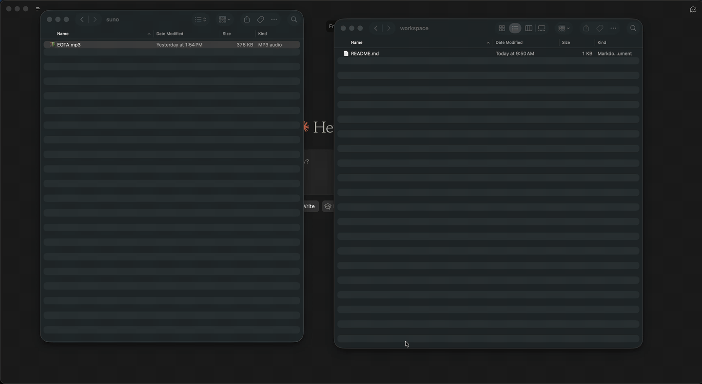

# ai-audio-provenance

Open-source **audio provenance** infrastructure with an MCP adapter so AI assistants can run auditable provenance analysis on **real-world AI audio** (local workspace files): inspect → verify credentials → distribution-stress → report.



## Quick start

```bash
python3 -m venv .venv && source .venv/bin/activate
pip install -e packages/audio_prov -e packages/audio_prov_mcp
python scripts/generate_fixtures.py
audio-prov check
audio-prov run provenance-analysis@1 --asset tone-wav
audio-prov batch --json              # sync: all files in workspace/
audio-prov batch --async --json      # async: returns batch_id, poll status
audio-prov sign-c2pa your-track.wav  # embed C2PA (dev cert by default)
```

See [docs/mcp-setup.md](docs/mcp-setup.md) for Claude Desktop configuration.

```bash
python scripts/wire_claude_desktop.py   # macOS: merge MCP config, then restart Claude
cp ~/Downloads/your-ai-track.mp3 workspace/
```

In Claude: use MCP `list_workspace_files` → `register_workspace_file` → tool **`analyze_ai_audio`** (not `provenance_run` with prompt name).

For large catalogs, use **`analyze_workspace_async`** then poll **`get_batch_run(batch_id)`**.

## Features

- **Workspace-first:** analyze your own MP3/M4A/WAV exports in `workspace/`
- **Multi-signal reports:** structural, verified, simulated, inferred (tag hints + watermark stub)
- **MCP tools:** `register_workspace_file`, `analyze_ai_audio`, `analyze_workspace_async`, `sign_c2pa_manifest`, etc.
- **Distribution presets:** `aac128`, `aac64`, `mp3_128`, `loudnorm_-14`, `copy`
- **Pluggable verify:** demo sidecar manifests + optional C2PA via `c2patool`
- **C2PA signing:** dev cert by default; operator keys via `AUDIO_PROV_C2PA_PRIVATE_KEY` / `AUDIO_PROV_C2PA_SIGN_CERT`

## Disclaimer

Analysis reports technical evidence only. Absent credentials do not prove synthetic origin. Demo sidecar manifests and default C2PA signing use development keys only.

## License

MIT
